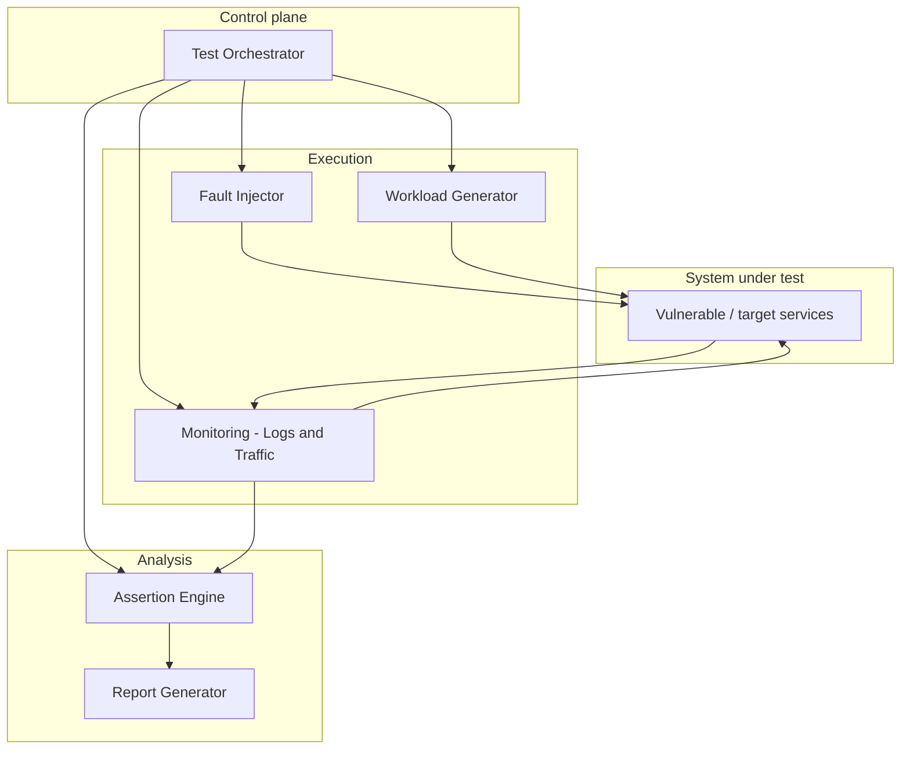

# Security & Chaos Engineering Framework

A chaos engineering framework for injecting controlled faults, driving workloads, observing system behavior, and producing structured reports. **Phase 1** focuses on infrastructure and application resilience (containers/VMs, resource stress, data perturbation, Kubernetes-friendly operation). **Phase 2** extends the same architecture with security monitoring, property assertions, and network-level chaos—designed as additive modules so they plug in without rewriting Phase 1.

> **Architecture reference:** High-level design follows [`implementation_guide.md`](implementation_guide.md). Sample code in that document illustrates patterns only; this README describes the intended system shape and requirements.

---

## Architecture overview

The system is **orchestrator-centric**: declarative scenarios (YAML) describe faults, workloads, duration, and (in later phases) security properties. The orchestrator schedules phases (baseline → injection → recovery → analysis), coordinates the **fault injector**, **workload generator**, and **monitoring** (logs and traffic), then passes observations to an **assertion engine** and **report generator**.



**Data flow (conceptual):** Scenario YAML → orchestrator parses and schedules → during the run, faults and workload run in parallel while monitors capture logs and inter-service traffic → on completion, assertions evaluate collected evidence → outputs are **HTML and JSON** reports (and optional machine-readable exports for analytics).

For Kubernetes, the same roles apply: the orchestrator (or a CI job) drives experiments against namespaced workloads; fault injection targets Pods/Nodes via the cluster API or a chaos controller, and monitoring scrapes logs/metrics/traces from the cluster.

---

## Functional requirements

### Phase 1 (current scope)

| Area | Requirement |
|------|-------------|
| **Fault injection** | Simulate problems at **container or VM** level: shutdowns, restarts, and **CPU or memory exhaustion** (and related resource pressure). |
| **Tests** | **Test case generation and execution** from declarative scenarios; reproducible runs with defined timelines. |
| **Load** | **Stress testing** via configurable workload generation (e.g., RPS, burst patterns). |
| **Data** | **Data chaos**: controlled corruption, skew, or inconsistency in test data or responses (scoped to non-production targets). |
| **Reporting** | **Reporting and analytics**: structured results (e.g., HTML + JSON), summaries, timelines, and hooks for dashboards or CI artifacts. |
| **Kubernetes** | **Easy integration with Kubernetes**: runbooks or manifests compatible with standard tooling (e.g., labeled namespaces, optional integration with chaos projects or `kubectl`-driven experiments). |

### Phase 2 (future work — integration-ready)

These are **out of scope for initial delivery** but the architecture reserves clear extension points so they integrate without replacing Phase 1:

| Area | Requirement |
|------|-------------|
| **Security monitoring** | Continuous or experiment-scoped **monitoring and detection** (suspicious patterns, policy violations) fed from the same log/traffic pipeline. |
| **Security assertions** | **Security property assertion** (e.g., no credential leakage, auth enforcement, isolation)—extends the assertion engine with pluggable rules. |
| **Network chaos** | **Network chaos**: packet loss, latency, partition, and bandwidth limits, composable with existing faults. |

**Integration principle:** Monitoring feeds the assertion engine; network faults are another **fault type** alongside compute and process-level faults; security rules are **additional assertion providers** sharing the same report schema.

---

## Components

| Component | Responsibility |
|-----------|----------------|
| **Test orchestrator** | Reads scenarios, schedules baseline/injection/recovery/analysis, coordinates lifecycle and cleanup. |
| **Fault injector** | Applies and removes faults (container/VM/process, resource limits, Phase 2: network policies). |
| **Workload generator** | Drives realistic or synthetic traffic for stress and scenario validation. |
| **Monitoring** | Aggregates logs and observes traffic (and later metrics/events) from the system under test. |
| **Assertion engine** | Evaluates resilience checks in Phase 1; **extends** to security properties in Phase 2 via pluggable assertions. |
| **Report generator** | Produces human-readable and machine-readable reports for analytics and CI. |
| **System under test** | Target application stack (e.g., microservices in Docker Compose or Kubernetes)—optional vulnerable demo stack for teaching. |

---

## Tech stack

| Layer | Typical choices |
|-------|-----------------|
| **Language / runtime** | Python 3.10+ (orchestration, assertions, reporting). |
| **Scenarios** | YAML (and optional JSON) for declarative experiments. |
| **Local / lab environments** | Docker, Docker Compose. |
| **Kubernetes** | `kubectl`, namespaces, workload identities; optional alignment with chaos tooling (e.g., Chaos Mesh, Litmus, custom Jobs). |
| **Fault mechanisms** | OS/container controls (`tc` for network where applicable), cgroup limits, process signals, cloud/VM APIs as needed. |
| **Observability** | Container logs, captured request metadata; optional Prometheus / Grafana for metrics (as in implementation guide “Next Steps”). |
| **Outputs** | HTML reports, JSON for automation and analytics pipelines. |

---

## Quick start

### Prerequisites

| Tool | Minimum | Purpose |
|------|---------|---------|
| Python | 3.10+ | Framework orchestration, assertions, reporting |
| pip | recent | Install Python dependencies |
| Docker + Compose plugin | Engine 24+ | Build and run `dummy_test` locally |
| `kubectl` | 1.27+ | Kubernetes backend for fault injection |
| Supabase CLI *(optional)* | latest | Local Supabase Auth for `dummy_test` |

---

## Setup

### 1 — Create a virtual environment and install dependencies

```bash
python -m venv .venv
```

Activate it:

```bash
# Linux / macOS
source .venv/bin/activate

# Windows PowerShell
.venv\Scripts\Activate.ps1
```

Install:

```bash
pip install -r requirements.txt
```

### 2 — Configure framework environment variables

Copy `.env.example` to `.env` at the repository root:

```bash
# Linux / macOS
cp .env.example .env

# Windows PowerShell
Copy-Item .env.example .env
```

Open `.env` and set values (see table below). The file is already in `.gitignore`; **never commit it**.

| Variable | Default | Description |
|----------|---------|-------------|
| `CHAOS_BACKEND` | `kubectl` | Execution backend: `kubectl` (real cluster) or `null` (unit-test / dry-run mode — no cluster needed). |
| `RESULTS_DIR` | `results` | Directory where HTML and JSON reports are written. |

> **Unit-test mode:** Set `CHAOS_BACKEND=null` so the framework runs without a real Kubernetes cluster. All fault operations are no-ops; useful for CI and local development.

---

## Running the framework

### Orchestrator CLI

Run a complete baseline → inject → recover → report pipeline from a scenario YAML:

```bash
python -m framework.cli --scenario scenarios/examples/pod_kill_auth.yaml
python -m framework.cli --scenario scenarios/examples/baseline_chaos.yaml --verbose
python -m framework.cli --scenario scenarios/examples/pod_pause_gateway.yaml --log-level DEBUG
```

Reports are written to `results/<run_id>.json` and `results/<run_id>.html`.

### Phase 1 load and stress scenarios

Use the workload block in YAML to drive HTTP traffic (RPS, optional **burst** pattern, and optional **fault_rps** during injection). Tune timing with **`phases`** so the orchestrator holds baseline and injection windows before recovery:

| Field | Purpose |
|-------|---------|
| `workload.rps` | Steady target requests per second (shared across workers). |
| `workload.burst_pattern` | Alternates `normal_rps` and `burst_rps` for stress-style traffic (see `scenarios/examples/skeleton.yaml`). |
| `workload.fault_rps` | During fault injection, effective RPS is `max(scheduled_rps, fault_rps)`. |
| `phases.baseline_duration_seconds` | Sleep after starting workload, before applying faults. |
| `phases.injection_duration_seconds` | Sleep while faults are active, before recovery. |
| `assertions.load` | Optional pass/fail checks on totals, success rate, failures, and mean latency (see scenarios below). |

Example scenarios (gateway at `http://localhost:8000`):

```bash
python -m framework.cli --scenario scenarios/phase1_load_steady.yaml
python -m framework.cli --scenario scenarios/phase1_load_burst.yaml
python -m framework.cli --scenario scenarios/phase1_load_burst_and_fault.yaml
```

Reports include **workload phase deltas**, **burst metadata**, and **load assertion** results. Set `WORKLOAD_BASE_URL` if you omit `workload.targets.base_url`.

### Fault injector CLI (single fault)

Inject a single fault and get back a JSON handle, then revert it:

```bash
# Inject — prints FaultHandle JSON to stdout
python -m framework.fault_injector inject --spec scenarios/examples/pod_kill_auth.yaml

# Save handle and revert later
python -m framework.fault_injector inject --spec scenarios/examples/pod_kill_auth.yaml > handle.json
python -m framework.fault_injector remove --handle handle.json
```

### Tests

```bash
# Unit tests (no cluster required; null backend used automatically)
pytest tests/unit/

# Integration tests (requires a kubectl-accessible cluster)
CHAOS_IT=1 pytest tests/integration/
```

---

## dummy_test setup

`dummy_test/` is a four-service FastAPI playground (gateway, svc-a, svc-b, auth) used as the system under test. Full instructions are in [`dummy_test/README.md`](dummy_test/README.md). The summary below gets you running quickly.

### Step 1 — Supabase credentials

Create `dummy_test/services/auth/.env` from the example file:

```bash
# Linux / macOS
cp dummy_test/services/auth/.env.example dummy_test/services/auth/.env

# Windows PowerShell
Copy-Item dummy_test/services/auth/.env.example dummy_test/services/auth/.env
```

Edit `dummy_test/services/auth/.env` and set the two required variables:

| Variable | Where to find it |
|----------|-----------------|
| `SUPABASE_URL` | Supabase dashboard → Project Settings → API → Project URL |
| `SUPABASE_KEY` | Supabase dashboard → Project Settings → API → anon public key |
| `DATABASE_URL` | Supabase dashboard → Project Settings → Database → Connection string (URI); omit if you apply migrations manually |

**Local Supabase CLI alternative:** From the `dummy_test/` directory run `supabase start`; use the printed API URL and anon key. Set `SUPABASE_URL=http://host.docker.internal:54321` when running inside Docker on Windows/macOS. See [`dummy_test/README.md`](dummy_test/README.md) → *Local Supabase (CLI)* for details.

Do **not** commit `dummy_test/services/auth/.env`.

### Step 2 — Build images

Run from the **repository root** (parent of `dummy_test/`):

```bash
docker build -f dummy_test/docker/Dockerfile.gateway -t dummy-test/gateway:latest dummy_test
docker build -f dummy_test/docker/Dockerfile.svc_a   -t dummy-test/svc-a:latest   dummy_test
docker build -f dummy_test/docker/Dockerfile.svc_b   -t dummy-test/svc-b:latest   dummy_test
docker build -f dummy_test/docker/Dockerfile.auth     -t dummy-test/auth:latest    dummy_test
```

Add `--no-cache` to force a clean rebuild.

### Step 3a — Run on Docker Compose (no Kubernetes cluster needed)

```bash
# Start all four services (gateway published on localhost:8000)
docker compose -f dummy_test/docker-compose.yml up --build -d

# Check status
docker compose -f dummy_test/docker-compose.yml ps
docker compose -f dummy_test/docker-compose.yml logs -f gateway auth

# Stop and remove containers
docker compose -f dummy_test/docker-compose.yml down
```

Verify the stack:

```bash
curl http://localhost:8000/health
curl http://localhost:8000/chain
curl -s -X POST http://localhost:8000/auth/signup \
  -H "Content-Type: application/json" \
  -d "{\"email\":\"user@example.com\",\"password\":\"your-password\"}"
```

### Step 3b — Run on Kubernetes

```bash
# 1. Create namespace and Supabase secret
kubectl apply -f dummy_test/k8s/00-namespace.yaml

kubectl create secret generic supabase-auth \
  --from-env-file=dummy_test/services/auth/.env \
  -n dummy-test --dry-run=client -o yaml | kubectl apply -f -

# 2. Deploy all services
kubectl apply -f dummy_test/k8s/

# 3. Wait for rollouts
kubectl wait --for=condition=available deployment \
  -l app.kubernetes.io/part-of=dummy-test \
  -n dummy-test --timeout=120s

# 4. Port-forward gateway (keep this terminal open)
kubectl port-forward -n dummy-test svc/gateway 8000:8000
```

In a second terminal, verify:

```bash
curl http://localhost:8000/health
curl http://localhost:8000/chain
```

Tear down:

```bash
kubectl delete -f dummy_test/k8s/
```

#### Minikube quick sequence

```bash
# Point Docker at Minikube's daemon (PowerShell)
minikube docker-env | Invoke-Expression

# Build images inside Minikube
docker build -f dummy_test/docker/Dockerfile.gateway -t dummy-test/gateway:latest dummy_test
docker build -f dummy_test/docker/Dockerfile.svc_a   -t dummy-test/svc-a:latest   dummy_test
docker build -f dummy_test/docker/Dockerfile.svc_b   -t dummy-test/svc-b:latest   dummy_test
docker build -f dummy_test/docker/Dockerfile.auth     -t dummy-test/auth:latest    dummy_test

# Create secret, deploy, and wait
kubectl create secret generic supabase-auth \
  --from-env-file=dummy_test/services/auth/.env \
  -n dummy-test --dry-run=client -o yaml | kubectl apply -f -
kubectl apply -f dummy_test/k8s/
kubectl wait --for=condition=available deployment \
  -l app.kubernetes.io/part-of=dummy-test -n dummy-test --timeout=120s
kubectl port-forward -n dummy-test svc/gateway 8000:8000
```

### Logs (Kubernetes)

```bash
kubectl logs -n dummy-test -l app.kubernetes.io/component=gateway --follow
kubectl logs -n dummy-test -l app.kubernetes.io/component=auth    --follow
```

> **Note:** The auth and gateway services log email and password on purpose for this playground. Do not copy this behaviour into production systems.

---

## Documentation

- **[`implementation_guide.md`](implementation_guide.md)** — Architecture details, setup patterns, and reference snippets (architecture guide; not the sole source of truth for production code layout—see [`REPOSITORY_STRUCTURE.md`](REPOSITORY_STRUCTURE.md)).
- **[`dummy_test/README.md`](dummy_test/README.md)** — Full endpoint reference, environment variable table, Supabase setup, Compose and Kubernetes run instructions for the test stack.
- **[`framework/README.md`](framework/README.md)** — Fault injector architecture, YAML spec format, backend and fault-type extension guide.
