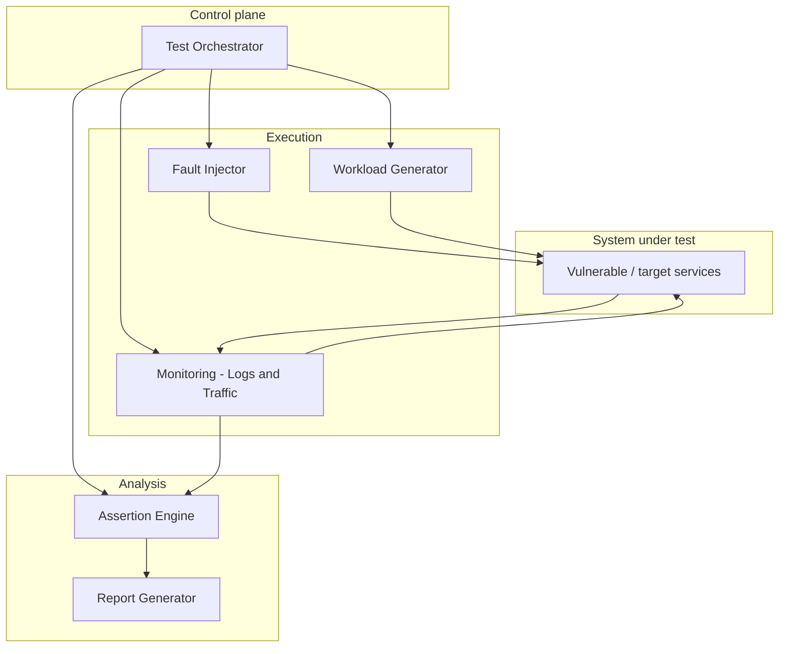

# Security & Chaos Engineering Framework

A chaos engineering framework for injecting controlled faults, driving workloads, observing system behavior, and producing structured reports. **Phase 1** focuses on infrastructure and application resilience (containers/VMs, resource stress, data perturbation, Kubernetes-friendly operation). **Phase 2** extends the same architecture with security monitoring, property assertions, and network-level chaos—designed as additive modules so they plug in without rewriting Phase 1.

> **Architecture reference:** High-level design follows [`implementation_guide.md`](implementation_guide.md). Sample code in that document illustrates patterns only; this README describes the intended system shape and requirements.

---

## Architecture overview

The system is **orchestrator-centric**: declarative scenarios (YAML) describe faults, workloads, duration, and (in later phases) security properties. The orchestrator schedules phases (baseline → injection → recovery → analysis), coordinates the **fault injector**, **workload generator**, and **monitoring** (logs and traffic), then passes observations to an **assertion engine** and **report generator**.

**Data flow (conceptual):** Scenario YAML → orchestrator parses and schedules → during the run, faults and workload run in parallel while monitors capture logs and inter-service traffic → on completion, assertions evaluate collected evidence → outputs are **HTML and JSON** reports (and optional machine-readable exports for analytics).

For Kubernetes, the same roles apply: the orchestrator (or a CI job) drives experiments against namespaced workloads; fault injection targets Pods/Nodes via the cluster API or a chaos controller, and monitoring scrapes logs/metrics/traces from the cluster.

---

## Functional requirements

### Phase 1 (current scope)

| Area | Requirement |
|------|-------------|
| **Fault injection** | Simulate problems at **container or VM** level: shutdowns, restarts, and **CPU or memory exhaustion** (and related resource pressure). |
| **Tests** | **Test case generation and execution** from declarative scenarios; reproducible runs with defined timelines. |
| **Load** | **Stress testing** via configurable workload generation (e.g., RPS, burst patterns). |
| **Data** | **Data chaos**: controlled corruption, skew, or inconsistency in test data or responses (scoped to non-production targets). |
| **Reporting** | **Reporting and analytics**: structured results (e.g., HTML + JSON), summaries, timelines, and hooks for dashboards or CI artifacts. |
| **Kubernetes** | **Easy integration with Kubernetes**: runbooks or manifests compatible with standard tooling (e.g., labeled namespaces, optional integration with chaos projects or `kubectl`-driven experiments). |

### Phase 2 (future work — integration-ready)

These are **out of scope for initial delivery** but the architecture reserves clear extension points so they integrate without replacing Phase 1:

| Area | Requirement |
|------|-------------|
| **Security monitoring** | Continuous or experiment-scoped **monitoring and detection** (suspicious patterns, policy violations) fed from the same log/traffic pipeline. |
| **Security assertions** | **Security property assertion** (e.g., no credential leakage, auth enforcement, isolation)—extends the assertion engine with pluggable rules. |
| **Network chaos** | **Network chaos**: packet loss, latency, partition, and bandwidth limits, composable with existing faults. |

**Integration principle:** Monitoring feeds the assertion engine; network faults are another **fault type** alongside compute and process-level faults; security rules are **additional assertion providers** sharing the same report schema.

---

## Components

| Component | Responsibility |
|-----------|----------------|
| **Test orchestrator** | Reads scenarios, schedules baseline/injection/recovery/analysis, coordinates lifecycle and cleanup. |
| **Fault injector** | Applies and removes faults (container/VM/process, resource limits, Phase 2: network policies). |
| **Workload generator** | Drives realistic or synthetic traffic for stress and scenario validation. |
| **Monitoring** | Aggregates logs and observes traffic (and later metrics/events) from the system under test. |
| **Assertion engine** | Evaluates resilience checks in Phase 1; **extends** to security properties in Phase 2 via pluggable assertions. |
| **Report generator** | Produces human-readable and machine-readable reports for analytics and CI. |
| **System under test** | Target application stack (e.g., microservices in Docker Compose or Kubernetes)—optional vulnerable demo stack for teaching. |

---

## Tech stack

| Layer | Typical choices |
|-------|-----------------|
| **Language / runtime** | Python 3.10+ (orchestration, assertions, reporting). |
| **Scenarios** | YAML (and optional JSON) for declarative experiments. |
| **Local / lab environments** | Docker, Docker Compose. |
| **Kubernetes** | `kubectl`, namespaces, workload identities; optional alignment with chaos tooling (e.g., Chaos Mesh, Litmus, custom Jobs). |
| **Fault mechanisms** | OS/container controls (`tc` for network where applicable), cgroup limits, process signals, cloud/VM APIs as needed. |
| **Observability** | Container logs, captured request metadata; optional Prometheus / Grafana for metrics (as in implementation guide “Next Steps”). |
| **Outputs** | HTML reports, JSON for automation and analytics pipelines. |

---

## Documentation

- **[`implementation_guide.md`](implementation_guide.md)** — Architecture details, setup patterns, and reference snippets (architecture guide; not the sole source of truth for production code layout—see [`REPOSITORY_STRUCTURE.md`](REPOSITORY_STRUCTURE.md)).
